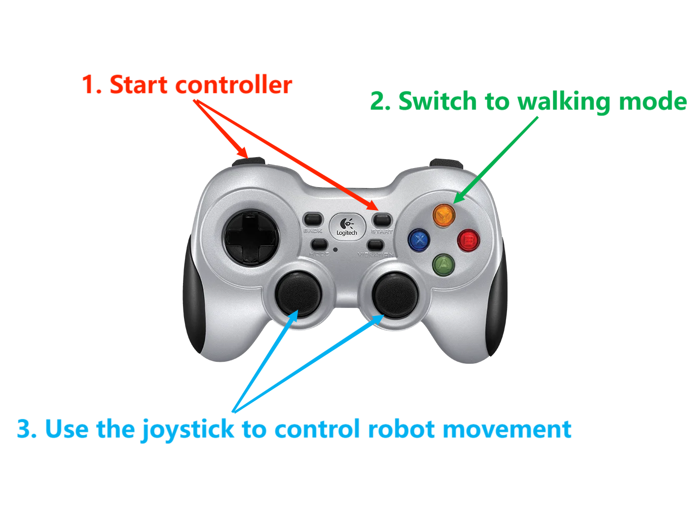

## hunter_bipedal_control

An open source bipedal robot control framework, based on non-linear MPC and WBC, tailered for EC-hunter80-v01 bipedal robot. For more information refer to the project's [Page](https://bridgedp.github.io/hunter_bipedal_control)

## Installation

### Install dependencies

- [OCS2](https://leggedrobotics.github.io/ocs2/installation.html#prerequisites)

- [ROS1-Noetic](http://wiki.ros.org/noetic)

### Clone and Build

```shell
# Clone
mkdir -p <catkin_ws_name>/src
cd <catkin_ws_name>/src
git clone https://github.com/bridgedp/hunter_bipedal_control.git

# Build
cd <catkin_ws_name>
catkin init
catkin config -DCMAKE_BUILD_TYPE=RelWithDebInfo
catkin build
```

## Quick Start

### Simulation

1. Run the simulation and load the controller:

```shell
roslaunch legged_controllers one_start_gazebo.launch
```

### Robot hardware

1. load the controller

```shell
roslaunch legged_controllers one_start_real.launch
```

***Notes:*** After the user starts the simulation, the robot falls down in Gazebo. The user needs to press ***Ctrl+Shift+R*** to make the robot stand up. Then, dynamic parameter adjustment is used in the code, and the user needs to set ***kpposition=100***, ***kdposition=3***.

## Gamepad Control

1. Start controller

```
L1 + start
```

2. Switch to walking mode

```
Y
```

3. Use the joystick to control robot movement

The following is a schematic diagram of the handle operation:



## Simulation Without Gamepad

Compilation: Only compile the following packages (and their dependencies), there's no need to compile the entire OCS2.

```bash
catkin build legged_controllers legged_hunter_description legged_gazebo
```

Execution: If you don't have a gamepad, you need to send the startup commands in order.

First, set ***kp_position=100*** in rqt and reset the simulation by pressing ***Ctrl+Shift+R*** to make the robot stand up. Then, send the following commands:

```bash
rostopic pub --once /load_controller std_msgs/Float32 "data: 1.23"
rostopic pub --once /set_walk std_msgs/Float32 "data: 1.23"
```

***Before /load_controller, there needs to be a node continuously sending /cmd_vel (10Hz is normal), and it should continue sending during the simulation. Once /cmd_vel stops, the robot may fall.***

As a example, here's a Python script that continuously sends /cmd_vel and allows keyboard control. You should start the script before  /load_controller. 

```python
#!/usr/bin/env python

import rospy
from geometry_msgs.msg import Twist
from pynput import keyboard
import threading

class KeyboardController:
    def __init__(self):
        self.publisher = rospy.Publisher('/cmd_vel', Twist, queue_size=1)
        self.twist_msg = Twist()
        self.rate = rospy.Rate(10)

    def on_press(self, key):
        try:
            if key.char == 'q':
                rospy.signal_shutdown("Quit")
            else:
                if key.char == 'w':
                    self.twist_msg.linear.x = 0.35
                elif key.char == 's':
                    self.twist_msg.linear.x = -0.35
                else:
                    self.twist_msg.linear.x = 0.0

                if key.char == 'a':
                    self.twist_msg.angular.z = 0.35
                elif key.char == 'd':
                    self.twist_msg.angular.z = -0.35
                else:
                    self.twist_msg.angular.z = 0.0
        except AttributeError:
            pass

    def on_release(self, key):
        self.twist_msg.linear.x = 0.0
        self.twist_msg.angular.z = 0.0

def ros_publish():
    while not rospy.is_shutdown():
        controller.publisher.publish(controller.twist_msg)
        controller.rate.sleep()


if __name__ == '__main__':
    rospy.init_node("keyboard_control")
    controller = KeyboardController()

    thread = threading.Thread(target=ros_publish)
    thread.start()

    listener = keyboard.Listener(on_press=controller.on_press, on_release=controller.on_release)
    listener.start()
    while not rospy.is_shutdown():
        pass

    listener.stop()
    listener.join()
    
    thread.join()
```

